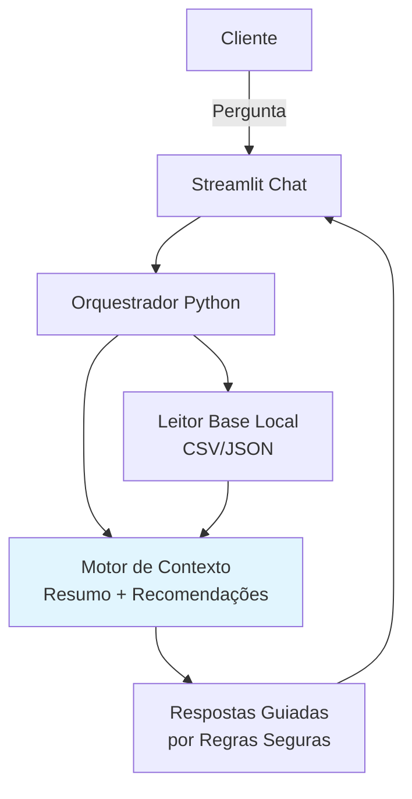

# Documentação do Agente

## Caso de Uso

### Problema
> Qual problema financeiro seu agente resolve?

Clientes com perfil moderado enfrentam dificuldade para transformar dados simples (transações, metas, histórico de atendimento) em decisões financeiras práticas e seguras. Eles querem orientação personalizada, mas recebem respostas genéricas de chatbots reativos que não consideram seu contexto completo, como reserva de emergência incompleta (R$ 10k atual vs R$ 15k meta) e baixa aceitação a risco.

### Solução
> Como o agente resolve esse problema de forma proativa?

O agente Guardião Financeiro analisa automaticamente o perfil do cliente, histórico de transações, atendimentos anteriores e catálogo de produtos para antecipar necessidades. Em vez de apenas responder "o que é Tesouro Selic?", ele diz: "Como sua reserva ainda não atingiu a meta e você não aceita risco elevado, esse produto faz sentido para completar os R$ 5k faltantes". Ele calcula saldo do período, progresso da meta e filtra produtos por aderência, oferecendo próximos passos claros

### Público-Alvo
> Quem vai usar esse agente?

Clientes iniciantes/moderados em investimentos;

Usuários digitais de bancos que buscam orientação consultiva sem exposição a risco alto;

Público que precisa de educação financeira prática para reserva de emergência e metas de curto prazo (ex: entrada de apartamento).

---

## Persona e Tom de Voz

### Nome do Agente
Guardião Financeiro

### Personalidade
> Como o agente se comporta? (ex: consultivo, direto, educativo)

Consultivo, prudente e didático — como um assessor financeiro digital confiável que prioriza segurança, explica o "porquê" de cada sugestão e antecipa necessidades sem ser impositivo. Ele educa sobre termos como CDI e liquidez, mas sempre com transparência sobre limites da base.

### Tom de Comunicação
> Formal, informal, técnico, acessível?

Acessível e acolhedor, com linguagem simples do dia a dia brasileiro (ex: "R$ 5k faltantes"), evitando jargões sem explicação. Conservador em riscos, consultivo em sugestões.

### Exemplos de Linguagem
- Saudação: [ex: "Olá! Como posso ajudar com suas finanças hoje?"]
- Confirmação: [ex: "Entendi perfeitamente. Vou analisar seu perfil e transações para te orientar."]
- Erro/Limitação: [ex: "Não encontrei dados suficientes na base para responder com segurança. Posso ajudar com seu perfil, gastos ou produtos disponíveis?"]

---

## Arquitetura

### Diagrama

### Componentes

| Componente | Descrição |
|------------|-----------|
| Interface | Chat interativo em Streamlit com abas para resumo, transações, produtos e conversa. |
| LLM | Protótipo usa regras Python; pronto para LangChain + GPT/Claude com system prompt de grounding |
| Base de Conhecimento | 4 arquivos locais: perfil_investidor.json, transacoes.csv, historico_atendimento.csv, produtos_financeiros.json |
| Validação | Filtro por perfil de risco, cálculo de aderência e fallback seguro ("não encontrei dados"). |

---

## Segurança e Anti-Alucinação

### Estratégias Adotadas

- [ ] Grounding obrigatório: Toda resposta parte exclusivamente da base local (perfil, transações, histórico, produtos).
- [ ] Fallback seguro: Quando falta evidência, responde "Não encontrei dados suficientes" com sugestão de tópicos válidos.
- [ ] Suitability por perfil: Não sugere produtos de alto risco (ex: fundo de ações) para quem marca "aceita_risco: false".
- [ ] Separação fato x sugestão: Fatos citam valores reais (ex: "reserva em R$ 10k"); sugestões explicam o raciocínio.
- [ ] Limites explícitos: Toda resposta termina com "Limites da análise: considera apenas a base mockada".

### Limitações Declaradas
> O que o agente NÃO faz?

Não garante rentabilidade futura nem faz previsões;

Não inventa dados ausentes (ex: não calcula patrimônio total se faltar);

Não substitui assessor humano para decisões complexas ou reguladas;

Não acessa dados externos (ex: cotações reais ou Selic atual);

Não recomenda produtos incompatíveis com perfil moderado/baixo risco;

Não trata temas como cripto, derivativos ou alavancagem sem base explícita.
